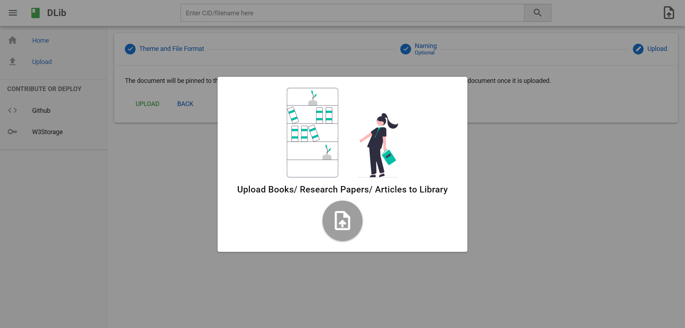
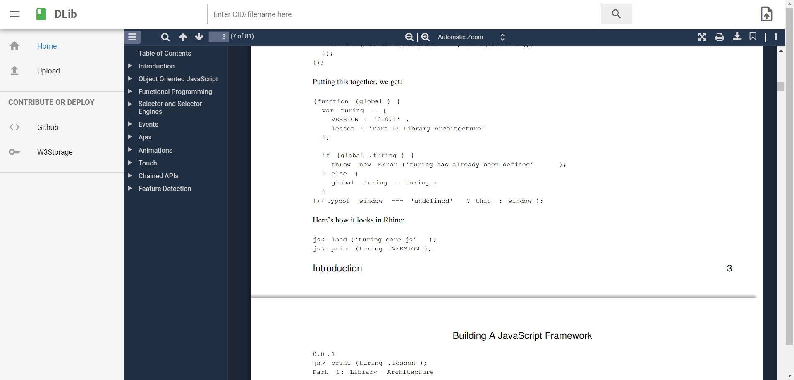
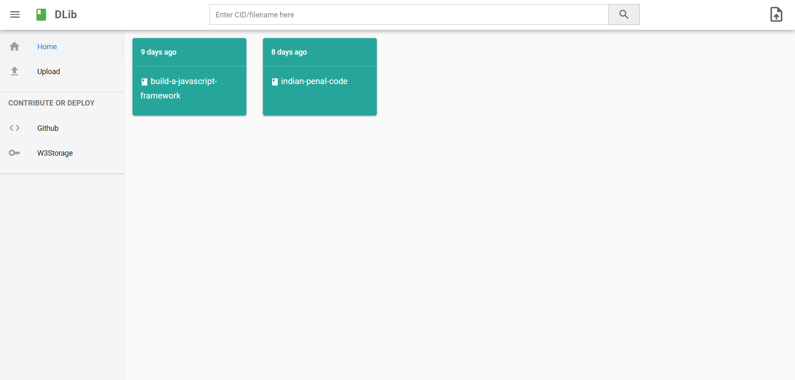
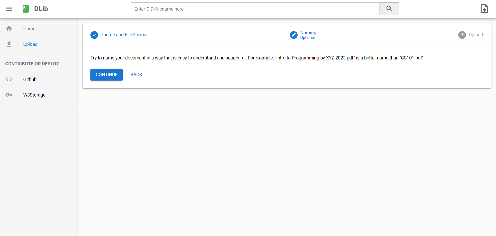

# DLib - Democratizing Knowlege Resources  (decentralized-library)

Submission for HackOdisha

Dlib is a decentralized library for books, research papers, exam papers, notes and articles. It allows users to create their own local or public decentralized libraries on the filecoin network and aims to abolish censorship and paywalls on books and articles. It also aims to prevent data users to get in the hands of third parties, due to which all personalized data is only stored locally and can be easily erased. 
Which target audience does it help / or who can use it ?
1. Schools, Universities, and Clubs to create their own local decentralized library where everyone can share resources without any paywall or proving personal data. 
2. Could be used for niche/community-specific startups. For example, during highschool days, I used to visit a site for getting preboard papers (respaper.com) issue with the site was, all the content was uploaded by the students but still students had to pay to access those papers. Dlib solves this issue and presents a generalized opensource project that people can use to create their free services (and maybe earn from ads) like a "decentralized library for sharing class 10 icse papers."
3. Many regions and countries have massive censoring. It will help people to read censored and banned books to gain knowledge.
4. This open-source project can be used to create a decentralized Story/Manga/LightNovel sharing Social Media platform where creators can share their work for others to read.

Prospects:
1. A hub to enable all the projects to connect to create a web of localized libraries.
2. More student-specific features like note-making, bookmarking,  exam mode, etc.

Screenshots: 
   

## Install the dependencies
```bash
yarn
# or
npm install
```

### Start the app in development mode (hot-code reloading, error reporting, etc.)
```bash
quasar dev
```


### Lint the files
```bash
yarn lint
# or
npm run lint
```


### Format the files
```bash
yarn format
# or
npm run format
```


### Build the app for production
```bash
quasar build
```

### Customize the configuration
See [Configuring quasar.config.js](https://v2.quasar.dev/quasar-cli-vite/quasar-config-js).
